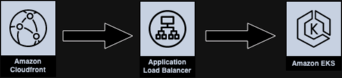

# Terraform Reference  - Deploying a NextJS app on EKS, fronted by Cloudfront 

This demo project is deployed in 3 parts to simplify Terraform (TF) dependency management.  
1) **EKS infrastructure:** The primary TF `apply`` deploys an EKS cluster, EC2 node-group and AWS Load Balancer Controller add-on. followed by a K8s deployment of a base NextJS container image (from Docker Hub).
2) **K8s application:** Deploys the NextJS application on K8s. The ingress manifest triggers the AWS Load Balancer Controller to create an ingress ALB. 
3) **Cloudfront:** The third TF `apply` deploys a Cloudfront distro with a custom origin using the ingress ALB created in part-2. The Cloudfront caching behavior uses the `CachingDisabled` Managed policy, intended for dynamic content. Secondary origins can be created to cache static content. 

## Architecture

.

## Prereqs

This was developed and tested with Terraform `v1.5.7`, AWScli `v2.13.18`. It is strongly recommended to deploy this is a sandbox or non-production account.

# Usage

Set the desired AWS region in each of the `variables.tf` files.

## Deploying with Terraform

Deploy Part-1 from the root project directory...
```
terraform init  ## initialize Terraform
terraform plan  ## Review what Terraform will do
terraform apply ## Deploy the resources
```

After Part-1 is complete, deploy Part-2...
```
cd k8s
terraform init
terraform plan
terraform apply
```
After Part-2 is complete, deploy Part-3 in the same manner...
```
cd ../cloudfront
terraform init
terraform plan
terraform apply
```
##  Cleaning up

Tear-down the resources in reverse order starting with part-3.  
**NOTE:** The K8s application ingress ALB must be manually deleted (command below) since TF doesn't directly manage this resource. 
```
terraform destroy ## part-3

cd ../k8s
kubectl delete ingress ingress-nextjs -n nextjs-sample-app
terraform destroy ## part-2

cd ..
terraform destroy ## part-1
```

## Accessing the Sample Site

Note the `cloudfront_domain_name` output in part-3.  The NextJS example app should be reachable via a web browser using this domain. 